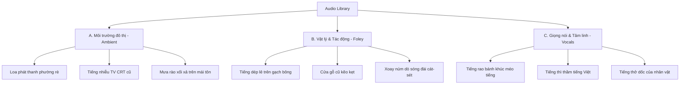

# PHÂN LOẠI ÂM THANH KINH DỊ VIỆT NAM (HORROR SOUND TAXONOMY)
**Mã tài liệu**: AUDIO-TAX-01
**Dự án**: Vietnam Horror AI Game Factory

Âm thanh chiếm 50% cảm giác sợ hãi trong game kinh dị. Tài liệu này định nghĩa cấu trúc phân loại (Taxonomy) các nguồn âm thanh mang tính bản địa Việt Nam, đồng thời hướng dẫn tích hợp chúng vào **Unreal Engine 5 MetaSounds** để tạo hiệu ứng âm thanh động theo thời gian thực.

---

## 1. Cấu Trúc Phân Loại Âm Thanh (Sound Taxonomy)

---

## 2. Chi Tiết Các Nhóm Âm Thanh Bản Địa

### A. Âm Thanh Môi Trường Đô Thị (Vietnamese Urban Ambient SFX)

| Mã Sound ID | Tên âm thanh | Mô tả chi tiết | Tác động tâm lý |
| :--- | :--- | :--- | :--- |
| `SND_AMB_LoaPhuong` | Loa phường rè | Nhạc hiệu phát thanh buổi sáng bị bóp méo, rè sóng do thời tiết ẩm ướt, xen lẫn tiếng rè cao tần. | Tạo cảm giác ngột ngạt của kỷ nguyên cũ, sự kiểm soát vô hình. |
| `SND_AMB_TV_Static` | Tivi CRT nhiễu | Tiếng "xè xè" (White Noise) của chiếc tivi Sony màn hình lồi cũ không có tín hiệu khi người chơi thức giấc giữa đêm. | Cảm giác cô lập, mất liên lạc với thế giới bên ngoài. |
| `SND_AMB_RoofRain` | Mưa mái tôn | Tiếng mưa rào nhiệt đới đập lộp bộp vào các tấm tôn xi măng/tôn sắt rỉ của khu trọ nghèo. | Tiếng ồn trắng che lấp đi các tiếng chân nhỏ của quái vật, tăng tính bất an. |
| `SND_AMB_Cicada` | Ve sầu kêu đêm | Tiếng ve sầu kêu râm ran mùa hè Hà Nội. Khi quái vật đến gần, tiếng ve sẽ **đột ngột tắt lịm**. | Sự im lặng đột ngột báo hiệu nguy hiểm cận kề. |

### B. Âm Thanh Vật Lý & Foley (Local Foley & Physics SFX)

| Mã Sound ID | Tên âm thanh | Mô tả chi tiết | Tác động tâm lý |
| :--- | :--- | :--- | :--- |
| `SND_FOL_DepLe` | Dép lê loẹt xoẹt | Tiếng dép tổ ong hoặc dép lào nhựa kéo lê trên nền gạch hoa cũ ướt nước. | Cảnh báo có một thực thể đang lững thững di chuyển đến gần mà không vội vã. |
| `SND_FOL_WoodDoor` | Cửa gỗ kẽo kẹt | Tiếng cửa ra vào bằng gỗ lim dày cũ kỹ bị ẩm phồng, khi đẩy phát ra tiếng rít khô khốc. | Cảm giác không gian chật hẹp, khó trốn thoát. |
| `SND_FOL_RadioStatic` | Dò sóng đài cát-sét | Tiếng xoay núm vặn đài, tiếng lạo xạo xẹt xẹt của sóng AM pha tạp âm của máy thu băng cũ. | Âm thanh trung gian dẫn dắt người chơi vào trạng thái giải đố. |

### C. Âm Thanh Siêu Nhiên & Giọng Nói (Paranormal & Vocalizations)

| Mã Sound ID | Tên âm thanh | Mô tả chi tiết | Tác động tâm lý |
| :--- | :--- | :--- | :--- |
| `SND_VOC_RaoDem` | Tiếng rao bánh khúc | Tiếng rao "Ai... bánh khúc... nóng... đê" từ đầu ngõ vọng vào lúc 2 giờ sáng, nhưng cao độ bị kéo dài và hạ thấp dần đầy ma quái. | Biến đổi cái bình dị thường nhật thành thứ đáng sợ. |
| `SND_VOC_Whisper` | Tiếng gọi dưới giếng | Tiếng phụ nữ thì thầm bằng tiếng Việt: *"Con ơi... dưới này lạnh lắm..."*, phát ra từ loa phát thanh hoặc trực tiếp từ lòng giếng sâu. | Dẫn dắt người chơi đi sâu vào câu chuyện và các lựa chọn kết cục. |
| `SND_VOC_Heartbeat` | Nhịp tim & Thở dốc | Tiếng thở dốc hốt hoảng và nhịp tim đập dồn dập của nhân vật chính tăng dần theo Stress Level. | Đồng bộ hóa nhịp sinh học của người chơi với nhân vật. |

---

## 3. Tích Hợp Kỹ Thuật Bằng MetaSounds (UE 5.4 Implementation)

Không nên sử dụng Sound Cue tĩnh thông thường. Với UE5, chúng ta dùng **MetaSounds** để xử lý âm thanh động:

### A. Sơ đồ xử lý MetaSound Loa Phường Rè (Procedural Speaker Distortion)
* **Đầu vào (Inputs)**:
  - `PlayerStress` (Float, 0.0 to 1.0)
  - `TriggerScreech` (Trigger)
* **Quy trình xử lý (DSP Chain)**:
  1. File nhạc nguồn `WAV_MusicLoaPhuong` được đưa qua một khối **Wave Player**.
  2. Kết nối tín hiệu Audio vào khối **Bandpass Filter** để lọc bỏ dải bass và treble, giả lập màng loa sắt cũ (chỉ giữ dải mid từ 800Hz - 4kHz).
  3. Sử dụng `PlayerStress` làm tham số điều khiển mức độ Gain của khối **Distortion/Overdrive Node**. Càng hoảng sợ, tiếng nhạc càng bị méo tiếng gắt tai.
  4. Nếu nhận trigger `TriggerScreech`, trộn thêm một tín hiệu **Sine Wave** tần số 3kHz có biên độ tăng giảm nhanh để giả lập tiếng rú rít của loa phóng thanh bị quá tải.

### B. Thiết lập Audio Reverb Presets cho Ngõ Trọ
* Tạo một **Submix Effect Reverb Preset** mô phỏng không gian ngõ sâu Hà Nội:
  - **Late Delay**: 45ms (mô phỏng âm thanh đập vào hai mảng tường nhà trọ đối diện cách nhau chỉ 2m).
  - **Decay Time**: 1.8s (tạo tiếng vang vọng dội lại dọc ngõ dài).
  - **Wet Level**: -12dB (âm thanh môi trường vang nhưng không bị nhòe mất tiếng động chính).
