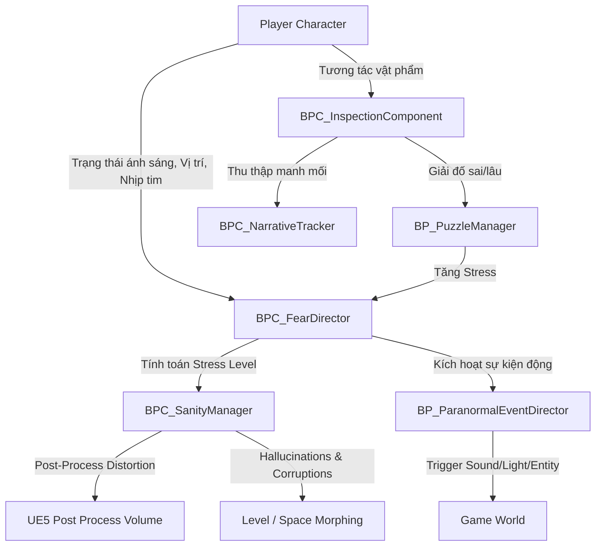

# TÀI LIỆU THIẾT KẾ HỆ THỐNG: FEAR & SANITY SYSTEM
**Mã tài liệu**: CORE-SYS-FEAR-01
**Dự án**: DƯỚI GIẾNG (Under the Well)

---

## 1. Tổng Quan Kiến Trúc (Architecture Overview)

Hệ thống điều khiển nỗi sợ và giải đố được thiết kế theo hướng hướng sự kiện (Event-Driven) để tối ưu hiệu suất trong Unreal Engine 5.4. Sơ đồ dưới đây thể hiện sự tương tác giữa các thành phần cốt lõi:

---

## 2. Fear Director System (Hệ Điều Phối Kinh Dị)

Fear Director là một Actor Component gắn vào GameMode của màn chơi, đóng vai trò như một bộ não điều phối nhịp độ kinh dị thay vì spawn ngẫu nhiên hoặc lặp đi lặp lại.

### A. Công thức tính toán Stress Level (Mức độ căng thẳng)
Stress Level ($S$) của người chơi là một giá trị từ 0 đến 100, được cập nhật mỗi giây:

$$S_{t} = S_{t-1} + (\Delta_{Dark} + \Delta_{Proximity} + \Delta_{PuzzleFail}) \times CooldownMultiplier$$

Trong đó:
* $\Delta_{Dark}$: Điểm stress cộng thêm khi người chơi đứng trong bóng tối hoàn toàn (không bật đèn pin, không có nguồn sáng tĩnh). Cộng +1.5 điểm/giây.
* $\Delta_{Proximity}$: Điểm stress cộng thêm dựa trên khoảng cách tới Thực thể (Entity). Cách Entity < 5m: cộng +5.0 điểm/giây; < 15m: cộng +2.0 điểm/giây.
* $\Delta_{PuzzleFail}$: Điểm stress cộng dồn lập tức khi giải đố sai (+15 điểm mỗi lần sai).
* $CooldownMultiplier$: Nếu một Sự kiện Tâm linh (Paranormal Event) vừa xảy ra, hệ thống sẽ kích hoạt thời gian hồi (Cooldown) kéo dài từ 20-30 giây để giảm mức độ nhạy cảm của người chơi. Trong thời gian này, $CooldownMultiplier = 0.2$.

### B. Trạng thái Sợ hãi và Phản ứng Môi trường
Dựa trên mức Stress hiện tại, Fear Director sẽ gửi lệnh tới hệ thống ánh sáng, âm thanh và kích hoạt sự kiện siêu nhiên:

| Cấp độ Stress | Mô tả trạng thái | Tác động môi trường | Tần suất Scare Event |
| :--- | :--- | :--- | :--- |
| **Cấp 1 (0 - 30)** | Bình tĩnh | Ánh sáng ổn định, âm thanh môi trường nhỏ nhẹ. | Không kích hoạt. |
| **Cấp 2 (31 - 60)** | Lo lắng nhẹ | Đèn neon thỉnh thoảng nhấp nháy khẽ. Tiếng dép lê bước đi lẹt xẹt ở phòng bên cạnh. | 90 - 120 giây một lần. |
| **Cấp 3 (61 - 80)** | Hoảng sợ | Đèn chớp liên tục hoặc tắt phụt trong 3 giây. Tiếng radio rè phát ra giọng khóc nghẹn. | 45 - 60 giây một lần. |
| **Cấp 4 (81 - 100)** | Hoang tưởng tột độ | Hiệu ứng rung màn hình nhẹ. Cửa phòng tự động sập mạnh. Bóng đen lướt qua gương. | 15 - 30 giây một lần. |

---

## 3. Sanity System (Hệ Thống Trạng Thái Tỉnh Táo)

Chỉ số Tỉnh táo (Sanity Index - từ 100% xuống 0%) tỉ lệ nghịch với Stress Level nhưng có quán tính phục hồi chậm hơn. 

### A. Hiệu ứng Post-Process & Âm thanh theo Sanity
* **Sanity > 75%**: Trực quan rõ ràng.
* **Sanity 50% - 75%**: Khởi chạy hiệu ứng **Chromatic Aberration** nhẹ (tách sắc màu ở rìa màn hình), tăng sắc độ tương phản tối.
* **Sanity 25% - 50%**: Kích hoạt **Vignette** tối bao phủ rìa camera, hiệu ứng mờ nhòe ống kính (Depth of Field) thay đổi theo nhịp thở. Âm thanh bắt đầu xuất hiện tiếng ù tai (High-frequency tinnitus) kết hợp với tiếng đài loa phường phát ra các thông điệp đứt quãng bằng tiếng Việt cổ.
* **Sanity < 25%**: **Space Corruption (Biến dạng không gian)**:
  - Khi người chơi không nhìn vào một vật thể hoặc một mảng tường (Out of Viewport), hệ thống sẽ tráo đổi cấu trúc màn chơi (ví dụ: biến một cánh cửa thoát hiểm thành một bức tường gạch đặc, hoặc kéo dài hành lang dài vô tận bằng cách di chuyển vị trí Actor phòng thực tế).
  - Xuất hiện ảo ảnh (Hallucinations): Bóng ma đứng im ở góc tối hoặc cuối hành lang. Khi người chơi hướng luồng sáng đèn pin vào trực tiếp, bóng ma sẽ tan biến thành làn sương đen mờ.

---

## 4. Clue & Puzzle Integration System (Hệ Thống Manh Mối & Giải Đố)

### A. Cơ chế Điều tra Manh Mối 3D (3D Investigation)
* Khi người chơi tương tác với một vật phẩm điều tra (Clue Object):
  1. Trạng thái điều khiển của người chơi chuyển từ Locomotion sang **Inspect Mode**.
  2. Vật thể được dịch chuyển mượt mà (sử dụng Interpolation) về phía trước camera của người chơi trên một trục ảo riêng tư.
  3. Người chơi có thể dùng chuột trái và kéo để xoay vật phẩm tự do trên 3 trục (Pitch, Yaw, Roll).
  4. **Raycast Hotspots**: Đặt các vùng phát hiện va chạm (Colliders) nhỏ trên các bề mặt khuất của vật thể (ví dụ: đáy chai thuốc, mặt sau ảnh). Khi người chơi xoay trúng vùng này và nhìn trực diện, một dòng chữ dịch nghĩa manh mối sẽ xuất hiện trên màn hình, đồng thời lưu trạng thái manh mối vào `BPC_NarrativeTracker`.

### B. Giải đố và Sự trừng phạt của Nỗi sợ (Puzzle Failure Penalty)
Hệ thống giải đố được tích hợp chặt chẽ với Fear Director:
* **Áp lực thời gian**: Khi người chơi mở giao diện giải đố (ví dụ: dò sóng radio hoặc xếp bàn thờ), game **không tạm dừng**. Người chơi vẫn nghe thấy tiếng động xung quanh.
* **Trừng phạt giải sai**: Mỗi lần người chơi nhập sai mật mã hoặc kết nối sai mạch điện phích cắm:
  - Cộng ngay lập tức **+15 Stress Level**.
  - Kích hoạt một sự kiện dọa ngẫu nhiên thuộc Cấp 3 hoặc Cấp 4 (ví dụ: tiếng đập cửa rầm rầm từ bên ngoài phòng đang giải đố) để ép buộc người chơi phải thoát màn hình giải đố và kiểm tra xung quanh, phá vỡ sự tập trung của họ.
* **Phát triển cốt truyện & Đa kết cục**: Khi một câu đố được giải xong, `BPC_NarrativeTracker` sẽ cập nhật tiến trình và quyết định mở khóa các sự kiện tiếp theo hoặc chuyển hướng cốt truyện sang các Ending tương ứng.
