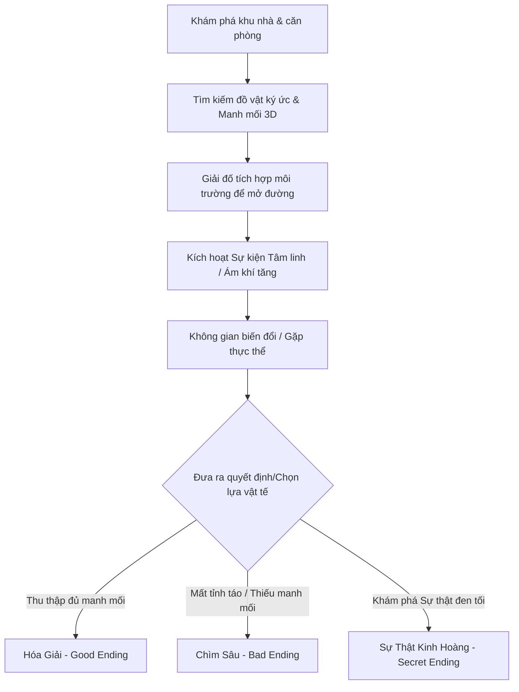

# TÀI LIỆU CONCEPT GAME: DƯỚI GIẾNG (UNDER THE WELL)
**Trạng thái**: Bản thảo Chiến lược v1 (Strategic Draft)
**Dự án**: Vietnam Horror AI Game Factory - Game #1
**Tác giả**: TVT Agency & AI Studio Specialist

---

## 1. Tổng Quan Dự Án (Project Overview)
* **Tên trò chơi**: DƯỚI GIẾNG (Under the Well)
* **Thể loại**: Kinh dị tâm lý (Psychological Horror) / Kinh dị đô thị Việt Nam (Vietnamese Urban Folk Horror).
* **Nền tảng**: PC (Steam)
* **Phong cách Đồ họa**: Low-Poly pha trộn Realistic Hybrid (Tận dụng ánh sáng Lumen của UE5 trên các mô hình 3D cổ điển thập niên 90 - 2000).
* **Thời lượng chơi (Scope v1)**: 30 – 45 phút (Gồm 1 khu nhà trọ cổ Hà Nội, 6 căn phòng và 1 sân chung).

---

## 2. Core Hook & Cốt Truyện (Narrative Core)
### Bối cảnh (The Setting)
Một ngõ trọ sâu thẳm, chật hẹp tại Hà Nội cũ chuẩn bị giải tỏa. Những bức tường vôi bong tróc, ẩm mốc màu vàng úa, những mảng gạch bông loang lổ, dây điện chằng chịt như mạng nhện, và chiếc bàn thờ gỗ nhỏ treo lạnh lẽo ở góc hành lang. Giữa sân trọ là một **Cái giếng cổ bị lấp bằng bê tông** với một lá bùa phong thủy đã phai màu.

### Điểm khởi đầu (The Setup)
Người chơi vào vai Nam, một thanh niên trẻ trở về khu nhà trọ cũ để thu dọn di vật của người bác vừa qua đời đột ngột vì chứng hoang tưởng trầm trọng. Khi trời tối dần, loa phường bắt đầu phát đi những thông báo giải tỏa kỳ lạ, những cánh cửa tự động khóa chặt, và Nam nhận ra anh không hề cô đơn trong khu nhà trọ này.

### Cảm xúc chủ đạo (Core Emotions)
* **Căng thẳng tĩnh (Fixed-Space Tension)**: Sự ngột ngạt của không gian hẹp, ẩm ướt và thiếu ánh sáng.
* **Cảm giác bị quan sát (Observation Anxiety)**: Cảm nhận có ánh mắt nhìn từ các góc tối, từ khe cửa hé hoặc từ chiếc gương hoen ố.
* **Hoang mang hiện thực (Narrative Ambiguity)**: Không phân biệt được đâu là ảo giác do stress và đâu là sự kiện tâm linh có thật.

---

## 3. Gameplay Loop (Vòng lặp Lối chơi Cốt lõi)

---

## 4. Cơ Chế Giải Đố & Tìm Manh Mối (Puzzle & Clue Investigation Mechanics)

### A. Tương Tác và Điều Tra Đồ Vật 3D (3D Object Inspection)
Người chơi không chỉ nhặt đồ vật vào kho đồ, mà phải trực tiếp cầm lên, phóng to, thu nhỏ và xoay 360 độ để tìm kiếm các thông tin ẩn giấu:
* **Mặt sau bức ảnh**: Xoay bức ảnh gia đình cũ sang mặt sau để đọc những dòng nhật ký bị gạch xóa hoặc vết máu khô chỉ ra mật mã hòm đồ.
* **Đáy ấm trà cổ**: Soi dưới đáy ấm trà đất nung để tìm chìa khóa nhỏ giấu bằng sáp nến.
* **Cuộn băng Cassette**: Kiểm tra kỹ nhãn dán bị xé rách để biết tần số radio cần dò.

### B. Các Câu Đố Tích Hợp Môi Trường (Environmental Puzzles)
* **Câu đố Bàn thờ Gỗ**: Sắp xếp 3 đĩa cúng tế (trái cây giả, trầu cau khô, nén nhang) đúng vị trí dựa trên một bài thơ thờ cúng dán trên tường để mở ngăn kéo bí mật chứa chìa khóa phòng bác.
* **Dò tần số Radio/Cassette**: Người chơi phải xoay nút dò tần số của chiếc radio đài cát-sét cũ. Khi tần số trùng khớp (ví dụ 98.0 MHz - năm xảy ra tai nạn), radio sẽ phát ra tiếng nói của người thân tiết lộ câu chuyện lịch sử, đồng thời mở cửa phòng tiếp theo.
* **Đấu nối Phích cắm Loa Phường**: Sắp xếp cầu chì hoặc phích cắm trong hộp điện hành lang để kích hoạt loa phường phát thanh, tạo tiếng ồn át đi tiếng chân của Thực thể, hoặc kích hoạt đèn neon rọi sáng hành lang bị nguyền rủa.

---

## 5. Cấu Trúc Phân Nhánh và Các Kết Cục (Branching Endings)

Tiến trình câu chuyện được theo dõi thông qua chỉ số **Ám Khí (Corruption Index)** và số lượng **Manh Mối Sự Thật (Truth Clues)** thu thập được:

| Kết cục (Ending) | Điều kiện kích hoạt | Mô tả trải nghiệm kết thúc | Ý nghĩa câu chuyện |
| :--- | :--- | :--- | :--- |
| **Kết cục 1: Hóa Giải** *(Good Ending)* | - Thu thập ít nhất 4/5 Vật phẩm ký ức. - Điểm Sanity > 40%. - Thực hiện nghi thức hóa vàng tại sân chung. | Nam đốt hết những kỷ vật đau thương của người thân, đổ cát lấp kín miệng giếng vĩnh viễn. Trời sáng, Nam bước ra khỏi con ngõ cũ khi nắng lên. | Giải thoát cho oan hồn dưới giếng và khép lại quá khứ đau thương. |
| **Kết cục 2: Chìm Sâu** *(Bad Ending)* | - Điểm Sanity xuống 0% hoặc nhảy trực tiếp xuống giếng khi chưa đủ manh mối. - Hoặc trốn chạy không thành công khi Thực thể săn đuổi ở phase cuối. | Bị tiếng gọi dưới giếng thôi miên, Nam đập vỡ lớp bê tông và nhảy xuống giếng. Camera hướng từ dưới đáy giếng lên, nắp giếng bị đóng sập lại từ bên ngoài. | Nam trở thành nạn nhân tiếp theo, tiếp tục vòng lặp oán linh của ngõ trọ. |
| **Kết cục 3: Sự Thật Kinh Hoàng** *(Secret Ending)* | - Thu thập đủ 5/5 Vật phẩm ký ức. - Đọc được bức thư tuyệt mệnh ẩn giấu trong bàn thờ gia bảo. - Đốt bức ảnh gia đình để phá hủy ảo ảnh cốt lõi. | Nam phát hiện ra một sự thật kinh hoàng: Người bác của anh chính là kẻ đã đẩy một cô gái trẻ xuống giếng năm 1998 để chiếm đất. Cô gái đó chính là mẹ ruột của anh, còn người "bố mẹ" nuôi dưỡng anh lâu nay chỉ là kẻ đồng khỏa. Oán hồn dưới giếng không muốn hại Nam, cô ta muốn anh biết sự thật. Nam chọn đốt bức ảnh gia đình, đốt cháy khu trọ để chôn vùi sự thật tàn khốc này cùng oán hận. | Sự thật phơi bày, sự báo thù nghiệt ngã của số phận. |

---

## 6. Lợi Thế Quy Trình AI-First (AI-First Leverage)
* **Art/Environment**: AI (Tripo/Blender automation) sinh nhanh các đồ vật Việt Nam thời xưa (phích nước Rạng Đông, phích cắm điện tròn màu cam, tivi Sony CRT cũ, đĩa sứ Hải Dương).
* **Audio**: Stable Audio và ElevenLabs tái tạo giọng đọc phát thanh viên loa phường rè nhiễu thập niên 90 bằng tiếng Việt đầy ám ảnh.
* **Logic/Blueprint**: Sử dụng AI Studio để viết code điều phối kinh dị tự động mà không cần lập trình viên kinh nghiệm nhiều năm.
